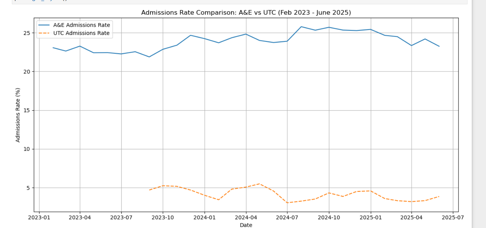
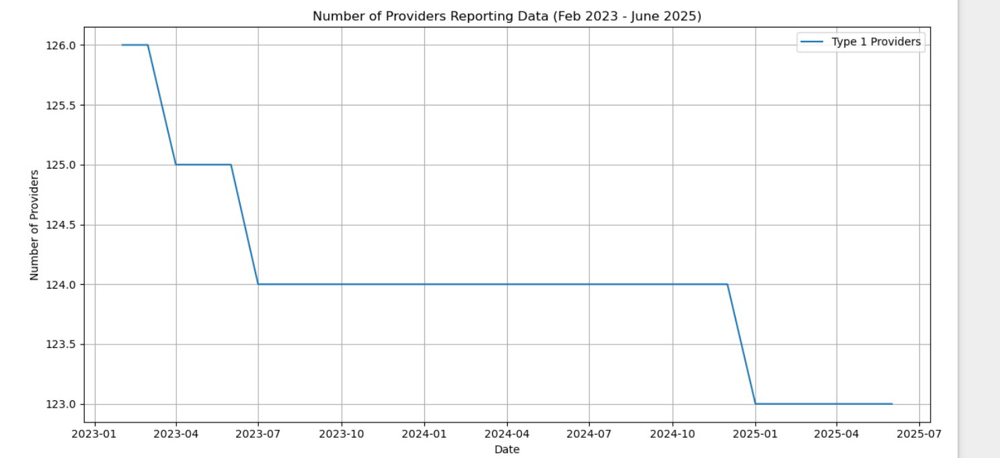
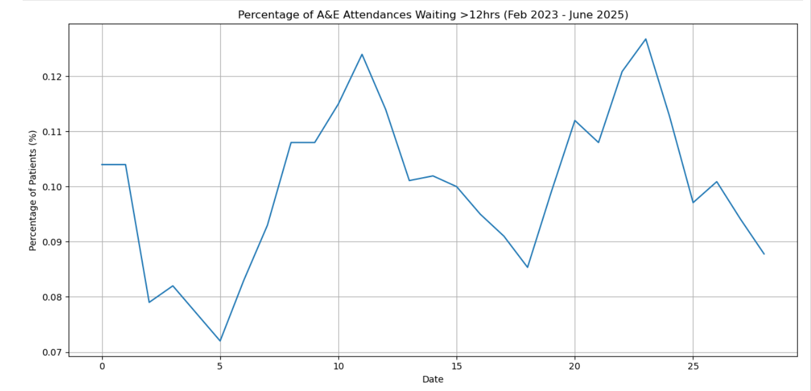

# NHS Waiting Time Analysis

## Project Description
This project analyses NHS waiting time data to identify trends, regional differences and operational bottlenecks in healthcare services.

## Tools Used
Python
Pandas
Matplotlib
Excel dataset

## Skills Demonstrated
Data Cleaning
Exploratory Data Analysis
Data Visualisation
Healthcare Data Analysis

## Key Insights
- Waiting times increased significantly after 2020
- Some regions show higher backlog levels
- Seasonal patterns influence healthcare demand

## Key Visualisations

### Admission Rate Comparison

This chart compares admission rates across reporting periods to identify trends in healthcare demand.

---

### Number of Providers Reporting Data

This visualisation shows how many healthcare providers reported data across the dataset.

---

### Percentage of A&E Attendance Waiting

This chart highlights the percentage of patients waiting in A&E, helping identify potential service delays and pressure on emergency departments.
