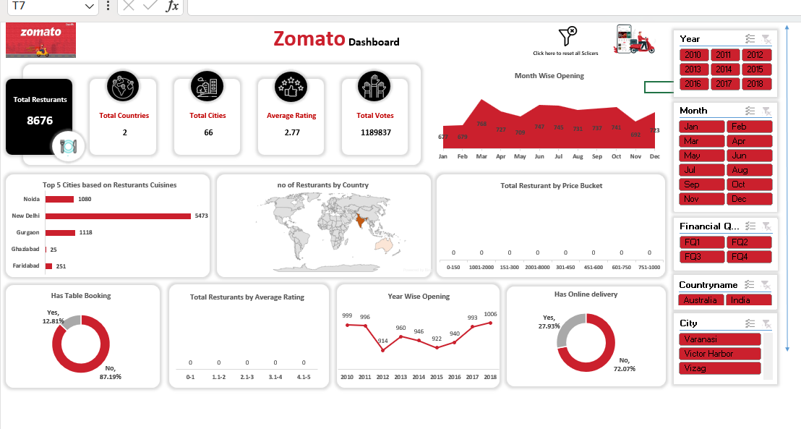
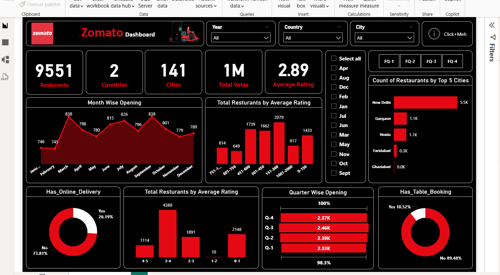

# Zomato Restaurant Data Analysis

## Project Overview
This project analyses Zomato restaurant data to understand customer preferences, restaurant performance, and location-based trends.

The dataset was cleaned in Excel and visualized using Power BI to identify useful insights for restaurant businesses.

## Tools Used
Excel (Data Cleaning)
Power BI (Dashboard & Visualization)

## Dataset Features
The dataset contains information about:
- Restaurant name
- City
- Cuisines
- Ratings
- Votes
- Cost for two
- Online delivery availability

## Key Analysis
- Restaurant rating distribution
- Cost analysis across restaurants
- Popular cuisines
- Restaurant vote trends
- Customer rating patterns

## Dashboard Insights
- Highly rated restaurants tend to receive more votes
- Certain cuisines dominate in popularity
- Pricing varies significantly across restaurant categories
- Online delivery options influence restaurant popularity

## Skills Demonstrated
- Data cleaning in Excel
- Exploratory data analysis
- Data visualization
- Business insights generation

 ## Dashboard Preview

 
## EXCEL PROJECT

## POWERBI PROJECT

